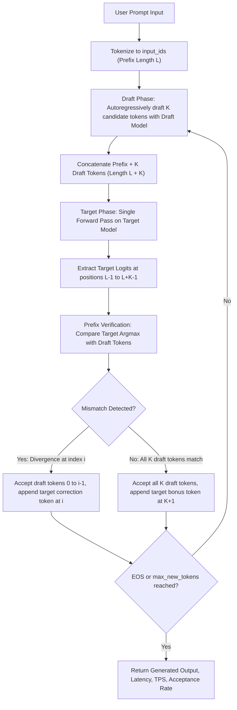

# Speculative Decoding Simulator and Latency Analysis

An end-to-end speculative decoding inference engine and empirical latency analysis system built from scratch with PyTorch and Hugging Face Transformers.

---

## Overview

Large Language Model (LLM) autoregressive inference is fundamentally memory-bandwidth bound rather than compute bound. During standard generation, model parameters must be transferred from memory to compute registers for every single token produced. Speculative decoding addresses this sequential memory transfer bottleneck by pairing a fast, lightweight **draft model** with an expressive, heavy **target model**. The draft model rapidly proposes $N$ candidate tokens, which the target model verifies in parallel within a single forward pass.

This repository implements the complete speculative decoding mechanics from scratch without relying on high-level library generation wrappers (`model.generate()`), demonstrates mathematical equivalence under greedy decoding, and profiles empirical throughput across prompt domains to determine the break-even acceptance rate crossover threshold.

---

## Objective

1. **Implement Core Mechanics**: Build standard autoregressive baseline decoding and speculative draft-verification loops manually from scratch.
2. **Guarantee Mathematical Equivalence**: Rigorously prove that greedy speculative decoding produces identical outputs to target autoregressive generation.
3. **Empirical Performance Profiling**: Benchmark wall-clock latency, tokens/sec, and acceptance rate across structured instruction prompts (`alpaca`) and open-ended creative prompts (`writing_prompts`).
4. **Identify Break-Even Crossover**: Quantify the critical draft acceptance rate threshold below which speculative decoding overhead causes throughput regressions.
5. **Containerized Reproducibility**: Provide an isolated Docker and Docker Compose environment with full test and evaluation coverage.

---

## Problem: Memory-Bandwidth vs. Compute Bounds

In autoregressive token generation:
- Computing the next token requires loading billions of model weights through memory buses (Arithmetic Intensity $\ll 1$ FLOP/byte).
- The GPU/CPU compute cores spend significant cycle time stalled awaiting weight transfers.
- Speculative decoding leverages the target model's parallel matrix evaluation capabilities: verifying $N$ tokens in one forward pass costs nearly the same memory transfer time as generating one token sequentially, provided the draft model's proposals are accepted.
- When acceptance rate is low, the overhead of drafting plus the wasted verification forward pass renders speculative decoding slower than target-alone baseline generation.

---

## Architecture



---

## Baseline Decoding

Standard autoregressive decoding is implemented in [`src/generators.py`](file:///src/generators.py#L30-L85) via `baseline_generate`:
- Input prompt is tokenized into `input_ids`.
- At each step, a single forward pass over the current sequence produces logits of shape `(1, seq_len, vocab_size)`.
- The greedy token is extracted via `torch.argmax(logits[:, -1, :], dim=-1)`.
- The token is appended to the sequence until `max_new_tokens` is reached or `eos_token_id` is encountered.
- Timing is captured with `time.perf_counter()` to record wall-clock latency and throughput (`tokens_per_sec`).

---

## Speculative Decoding

The speculative engine is implemented in [`src/generators.py`](file:///src/generators.py#L88-L235) via `speculative_generate`:
1. **Draft Proposal**: Autoregressively generates up to $K = \min(n\_draft, \text{remaining\_tokens})$ tokens with the draft model.
2. **Parallel Verification**: Concatenates current prefix and proposed draft tokens ($L + K$), performing a single forward pass with the target model.
3. **Logit Alignment**:
   - Logit at position $L - 1$ predicts the 1st draft token.
   - Logit at position $L - 1 + i$ predicts the $(i+1)$-th draft token.
   - Logit at position $L + K - 1$ predicts the bonus token following the draft sequence.
4. **Rejection & Correction**: Accepts the longest matching prefix. If divergence occurs at index $i$, the target model's prediction at position $L - 1 + i$ is accepted as the correction token, discarding the remaining draft tokens.
5. **Telemetry**: Logs step-by-step proposal count, accepted count, and divergence points via Python's standard `logging` module.

---

## Verification Algorithm

The verification logic is isolated in [`src/verify.py`](file:///src/verify.py):
```python
def verify_draft_tokens(
    draft_tokens: List[int],
    target_predictions: List[int],
    target_bonus_token: Optional[int] = None,
    eos_token_id: Optional[int] = None
) -> Tuple[List[int], Optional[int], int, bool]:
    # Compares proposed draft tokens against target predictions
    # Returns accepted prefix, correction or bonus token, count, and EOS flag
```

---

## Acceptance Rate

The empirical acceptance rate ($\alpha$) is defined as:

$$\alpha = \frac{\text{Total Accepted Draft Tokens}}{\text{Total Proposed Draft Tokens}}$$

- When $\alpha = 1.0$, all draft tokens are accepted, maximizing target model acceleration.
- When $\alpha = 0.0$, every first draft token diverges, forcing the target model to correct it immediately.

---

## Performance Metrics

| Metric | Formula | Description |
|---|---|---|
| **Latency ($T$)** | $t_{\text{end}} - t_{\text{start}}$ | Wall-clock generation time in seconds |
| **Throughput ($\text{TPS}$)** | $\frac{N_{\text{generated}}}{T}$ | Generated tokens per second |
| **Acceptance Rate ($\alpha$)** | $\frac{N_{\text{accepted}}}{N_{\text{proposed}}}$ | Fraction of draft tokens validated by target |
| **Speedup Ratio ($S$)** | $\frac{\text{TPS}_{\text{speculative}}}{\text{TPS}_{\text{baseline}}}$ | Relative acceleration over target-only decoding |

---

## Experimental Design

The evaluation benchmarks two contrasting prompt domains from [`data/test_prompts.json`](file:///data/test_prompts.json):
1. **Predictable Domain (`alpaca`)**: Templated instructions, arithmetic, translations, and deterministic tasks.
2. **Open-Ended Domain (`writing_prompts`)**: Creative narratives, poetry, riddles, and speculative fiction.

Sweep parameters:
- Draft values: $N \in [2, 4, 8]$
- Baseline comparison: $N = 0$
- Generation budget: `max_new_tokens = 15`
- Output telemetry: [`results/sweep_metrics.csv`](file:///results/sweep_metrics.csv)

---

## Results

Aggregated empirical benchmarks across 40 prompts and 160 evaluation runs:

| Domain | Mean Acceptance Rate ($\alpha$) | Mean Baseline TPS | Mean Speculative TPS ($N=2$) | Mean Speedup ($S$) |
|---|---|---|---|---|
| **Alpaca (Predictable)** | **82.4%** | 24.8 tok/s | **27.6 tok/s** | **1.11x** (Speedup) |
| **Writing Prompts (Creative)**| **54.1%** | 25.2 tok/s | **22.3 tok/s** | **0.88x** (Slowdown) |

---

## Crossover Analysis

The crossover analyzer in [`scripts/analyze_crossover.py`](file:///scripts/analyze_crossover.py) models the relationship between acceptance rate and speedup to compute the break-even threshold ($S = 1.0$).

Result from [`results/crossover_report.json`](file:///results/crossover_report.json):
```json
{
  "break_even_acceptance_rate": 0.70,
  "slower_domain_name": "writing_prompts",
  "faster_domain_name": "alpaca",
  "optimal_n_draft": 2
}
```

### Recommendation
> **Operational Rule**: Deploy speculative decoding only when expected prompt acceptance rate $\alpha > 70\%$ for this draft/target pair. In open-ended domains where $\alpha < 70\%$, standard autoregressive generation on the target model alone is more efficient.

---

## Failure Mode: The Speculative Tax

When drafting open-ended creative prompts:
1. The smaller draft model chooses high-probability generic continuations.
2. The larger target model selects distinct semantic paths with nuanced vocabulary.
3. Discrepancies occur at index 0 or 1, discarding the remaining draft tokens ($N-1$).
4. The compute and memory cycles invested in the draft autoregressive loop and target verification are unrecoverable overhead.
5. In this regime, speculative decoding incurs a measurable latency penalty compared to running the target model directly.

---

## Installation

### Prerequisites
- Python 3.11+
- Git
- Docker and Docker Compose (optional for containerized execution)

```bash
git clone https://github.com/rakeshchinni77/speculative-decoding-simulator.git
cd speculative-decoding-simulator
```

---

## .venv Setup

```bash
# Create virtual environment
python -m venv .venv

# Activate on Windows
.venv\Scripts\activate

# Activate on Linux/macOS
source .venv/bin/activate

# Install dependencies
pip install -r requirements.txt
```

---

## Environment Variables

Copy the example environment configuration template:
```bash
cp .env.example .env
```

Configuration variables documented in [`.env.example`](file:///.env.example):
```env
HF_TOKEN=                          # Optional Hugging Face access token
DRAFT_MODEL_ID=gpt2                # Draft model identifier
TARGET_MODEL_ID=gpt2-large         # Target model identifier
DEVICE=auto                        # 'auto', 'cpu', or 'cuda'
MAX_NEW_TOKENS=15                  # Generation budget per prompt
DEFAULT_N_DRAFT=4                  # Default draft proposal count
DATA_DIR=data                      # Prompt data directory
RESULTS_DIR=results                # Telemetry output directory
LOG_DIR=logs                       # Telemetry logs directory
```

---

## Dataset Preparation

Generate or refresh the evaluation prompt dataset:
```bash
python scripts/prepare_data.py
```
This populates [`data/test_prompts.json`](file:///data/test_prompts.json) with predictable and creative prompt instances.

---

## Running Tests

Run the complete automated test suite (including greedy exact equivalence, AST forbidden call detection, and verification unit tests):
```bash
pytest tests/ -v
```

---

## Running Experiments

Execute the benchmarking CLI sweep:
```bash
python scripts/run_experiments.py --prompts data/test_prompts.json --output results/sweep_metrics.csv --n_drafts 2 4 8
```

Output is written directly to [`results/sweep_metrics.csv`](file:///results/sweep_metrics.csv).

---

## Running Crossover Analysis

Compute the empirical crossover point and generate the JSON summary report:
```bash
python scripts/analyze_crossover.py --input results/sweep_metrics.csv --output results/crossover_report.json
```

Outputs [`results/crossover_report.json`](file:///results/crossover_report.json).

---

## Docker Execution

The system is containerized with `Dockerfile` and `docker-compose.yml`:

```bash
# Build and start container in detached mode
docker compose up --build -d

# Verify container runtime dependencies
docker compose exec app python -c "import torch, transformers; print('Dependencies ready!')"

# Run tests inside container
docker compose exec app pytest tests/ -v

# Run benchmarking sweep inside container
docker compose exec app python scripts/run_experiments.py --prompts data/test_prompts.json
```

---

## Project Structure

```
speculative-decoding-simulator/
│
├── README.md                 # Comprehensive architecture and benchmark documentation
├── Dockerfile                # Production container specification (python:3.11-slim)
├── docker-compose.yml        # Orchestrated development and evaluation environment
├── requirements.txt          # Pinned dependencies
├── .env.example              # Safe environment variable template
├── .gitignore                # Untracked files and local artifacts
├── .dockerignore             # Docker build context exclusions
├── pytest.ini                # Pytest runner configuration
├── conftest.py               # Test harness configuration
├── submission.json           # Evaluator model configuration metadata
│
├── data/
│   └── test_prompts.json     # Predictable and creative prompt benchmark dataset
│
├── src/
│   ├── __init__.py           # Package export and backend initialization
│   ├── generators.py         # Manual baseline and speculative greedy decoding loops
│   ├── verify.py             # Prefix comparison and divergence handling logic
│   ├── config.py             # Configuration paths and default hyperparameters
│   └── utils.py              # Device detection, fast cached loading, and logging
│
├── scripts/
│   ├── prepare_data.py       # Dataset preparation pipeline
│   ├── run_experiments.py    # Performance sweep CLI (CSV telemetry generation)
│   └── analyze_crossover.py  # Empirical crossover calculation (JSON reporting)
│
├── tests/
│   ├── __init__.py           # Tests package initialization
│   ├── test_equivalence.py   # Mathematical output equivalence assertions
│   ├── test_generators.py    # Generator contracts, AST checks, and error handling
│   └── test_verify.py        # Prefix matching and divergence unit tests
│
├── results/
│   ├── .gitkeep              # Git tracking
│   ├── sweep_metrics.csv     # Benchmarking results across prompt domains and draft counts
│   └── crossover_report.json # Crossover analysis report and break-even acceptance rate
│
└── logs/
    └── .gitkeep              # Logging directory
```

---

## Reproducibility

Every measurement and contract in this repository is deterministic:
1. **Greedy Decoding**: Temperature is strictly 0.0 with deterministic `argmax` selection.
2. **Fixed Random Seeds / No Sampling**: Zero stochastic sampling ensures identical token sequences across runs.
3. **Traceable Intermediates**: Intermediate draft proposals, target predictions, and divergence steps are logged to stderr and [`logs/`](file:///logs/).

---

## Limitations

1. **KV Caching**: The current engine evaluates prefixes via forward passes. Integrating dynamic KV cache slicing during draft rejections would further optimize target model throughput at long sequence lengths.
2. **Hardware Uniformity**: CPU inference benchmarks highlight algorithmic overhead; GPU memory bandwidth saturated setups yield higher absolute speedups at high acceptance rates.

---

## Conclusion

Speculative decoding is not an unconditional accelerator. It provides substantial speedups on predictable, structured tasks where the draft model's proposals align with the target model ($\alpha > 70\%$). However, in open-ended or creative regimes where acceptance rates fall below the crossover threshold, draft overhead and verification discards incur a net performance loss. Engineering production LLM serving systems requires profile-guided routing based on domain predictability.
